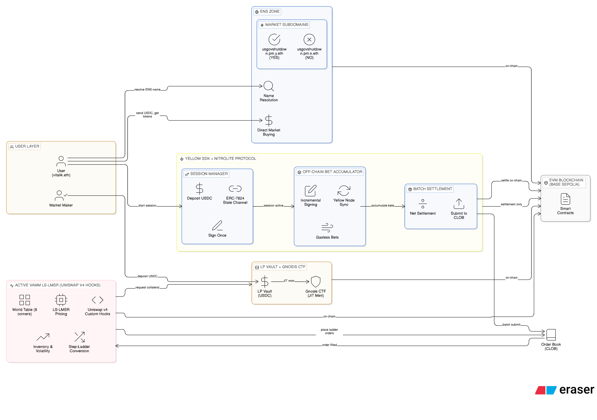

# Unified Liquidity Multi-Dimensional Prediction Market (Joint-Outcome AMM)

- **Yellow Demo**: [Watch Video](https://www.canva.com/design/DAHAwLXJXFg/pZ1vXn8_x9smzPB_g5OIow/watch?utm_content=DAHAwLXJXFg&utm_campaign=designshare&utm_medium=link2&utm_source=uniquelinks&utlId=h34007d3fb2)
- **ENS Demo**: [Watch Video](https://www.canva.com/design/DAHAwGt4MdA/oNNzBO-g-H2M_9ywsv7QnA/watch?utm_content=DAHAwGt4MdA&utm_campaign=designshare&utm_medium=link2&utm_source=uniquelinks&utlId=h1552841f0f)

**One-liner:** A combined prediction market that pools liquidity across multiple correlated Yes/No questions by pricing them through a single joint-outcome (“world table”) AMM, while still letting users trade simple binary markets and “partial” multi-event slices.

---

## TL;DR

Prediction markets often fragment liquidity across many correlated questions (e.g., related geopolitics events), causing wide spreads and inconsistent probabilities.  
This project proposes a **single shared market-making engine** over the **joint outcomes** of multiple binary events, so:

- One liquidity pool supports *all* correlated questions.
- Prices remain coherent (no contradictory implied probabilities).
- Users can trade:
  - **Simple binary bets** (e.g., “Event A = Yes”)
  - **Partial multi-event bets** (e.g., “A = Yes AND B = Yes, regardless of C”)
  - **Exact scenario bets** (e.g., “A=Yes, B=Yes, C=No”)

All contracts still resolve to **$1 per share** if they win, **$0** otherwise. “Bigger upside” comes from buying more shares at lower prices (more specific scenarios are cheaper).

---

## Problem

### Liquidity Fragmentation
In typical prediction markets, each question is its own market / book:

- Market A: P(A=Yes)
- Market B: P(B=Yes)
- Market C: P(C=Yes)

Even if these events are strongly correlated, liquidity is split across separate pools/orderbooks, leading to:
- Wider spreads (less depth per market)
- Slower price discovery
- Incoherence (prices don’t move together unless arbitrage traders manually sync them)

### Incoherent Odds Across Correlated Events
Separate markets can imply contradictory “stories of the world.”
Example: “Israel strike” jumps to 70%, but “US strike” stays flat even if historically/structurally correlated.

---

## Solution: One Shared “World Table” (Joint Distribution)

Instead of 3 separate markets, run **one unified source of truth** under the hood:

### The World Table
For **N binary events**, there are **2^N joint outcomes** (“world states”).

For N=3 events A, B, C → 8 worlds:

| World (A,B,C) | Meaning |
|---|---|
| 000 | A no, B no, C no |
| 001 | A no, B no, C yes |
| 010 | A no, B yes, C no |
| 011 | A no, B yes, C yes |
| 100 | A yes, B no, C no |
| 101 | A yes, B no, C yes |
| 110 | A yes, B yes, C no |
| 111 | A yes, B yes, C yes |

The engine maintains probabilities/prices for each world:
- `p000, p001, ... p111`
- All non-negative
- Sum to 1 (probability simplex)

This world table is the **single “source of truth.”**

### Deriving Displayed Odds (Marginals / Slices)
User-facing odds for individual questions are **derived** from the world table.

Example:
- `P(A=Yes) = p100 + p101 + p110 + p111`
- `P(B=Yes) = p010 + p011 + p110 + p111`
- `P(C=Yes) = p001 + p011 + p101 + p111`

So users still see familiar Yes/No markets, but those are *views* of the one joint model.

---

## Betting Types (User-Facing Contracts)

All contracts pay **$1 per share if the contract condition is satisfied**, else $0.

### 1) Marginal (Single Event) — “Normal” Binary Bet
> **A=Yes regardless of B,C**

This is a 1D slice: it groups all worlds where A=1:
- {100,101,110,111}

Payout:
- $1 per share if A resolves Yes
- $0 otherwise

Price:
- `price(A=Yes) = P(A=Yes)` (derived from world table)

### 2) Slice (Partial Multi-Event Bet) — “Ignore One Dimension”
> **A=Yes AND B=Yes, regardless of C**

This is a 2D slice: it groups:
- {110,111}

Payout:
- $1 per share if (A=Yes AND B=Yes)
- $0 otherwise

Price:
- `price(A=Yes,B=Yes) = p110 + p111`

Intuition:
- Slice is easier to win than an exact scenario (more worlds included),
- so it typically costs more per share.

### 3) Corner (Exact Scenario / Absolute Bet)
> **A=Yes, B=Yes, C=No** (world 110)

This is the most specific bet: one exact world.

Payout:
- $1 per share if the final world is exactly 110
- $0 otherwise

Price:
- `price(110) = p110`

Intuition:
- Corner is harder to win (one exact outcome),
- so it’s usually cheaper per share.

---

## Why “More Specific = Bigger Upside” (Without Changing Payout Rules)

Payout is always **$1 per share**.  
Your total payout depends on how many shares you bought.

If you spend `$1 USDC`:

- Shares bought = `1 / price`

Example:
- Corner price = $0.10 → you buy 10 shares → win pays $10
- Slice price = $0.20 → you buy 5 shares → win pays $5

So:
- **Corner**: cheaper → more shares → bigger payout if right, but lower hit-rate  
- **Slice**: more expensive → fewer shares → smaller payout, but higher hit-rate

This naturally matches user intuition: precision = higher risk/higher reward.

---

## Why Not Use “1/n payout”?

Scaling payouts by 1/n (e.g., each event pays $1/3) mostly just changes units:
- users will buy 3x shares to get the same exposure
- it does **not** merge liquidity across markets

Liquidity pooling comes from **one shared joint engine**, not from payout scaling.

---

## AMM Design: Active vAMM + LS-LMSR on CLOB

We replace the passive pool model with an **Active Virtual AMM (vAMM)** that acts as a "Robot Market Maker" on a **Central Limit Order Book (CLOB)**.

### 1. The Engine: LS-LMSR (Liquidity-Sensitive)

Standard LMSR has a "static liquidity" bug. We upgrade to **LS-LMSR**:

| Feature | Description |
|---------|-------------|
| **Dynamic Depth** | The liquidity parameter `b` grows with market volume: `b = α × Volume` |
| **Benefit** | The market deepens automatically. "Whales" can trade with lower slippage as the market matures |

### 2. Execution: vAMM vs. User Limit Orders

The vAMM calculates a **"Fair Price"** and places **Limit Orders**. Users can undercut this price. The CLOB always fills the **Best Price First**.

**Example: Trading "Event A"** (vAMM fair value = $0.60)

| Rank | Price | Seller | Status (Who gets filled?) |
|------|-------|--------|---------------------------|
| 1st | $0.58 | User Steve | **Executed First.** (Best Price for Buyer) |
| 2nd | $0.60 | vAMM (Robot) | Executed Second. (Only if Steve runs out) |
| 3rd | $0.65 | User Alice | Executed Third. (Worst Price) |

- **Buying:** Lowest Price wins (User Steve > vAMM)
- **Selling:** Highest Price wins (vAMM > Lowballers)

### 3. Step-Ladder Liquidity (The Iceberg)

The vAMM does **not** place one order for "Infinity Shares." It places a **Ladder of orders** to represent slippage visually:

```
Order 1: 500 shares @ $0.60
Order 2: 500 shares @ $0.61
Order 3: 500 shares @ $0.62
...
```

This allows the CLOB to function normally while accessing the vAMM's infinite depth.

### 4. Just-In-Time (JIT) Minting

When a user trades against the vAMM:

1. User sends USDC
2. vAMM adds its own subsidy (if needed) to complete the $1.00 collateral
3. Gnosis CTF mints the **Full Set** (Outcomes A-H)
4. vAMM gives the User their share (A) and keeps the rest (B-H) in its inventory

### 5. Safety Mechanisms (LP Protection)

To prevent the vAMM from being drained in extreme conditions, we implement three defenses:

#### 5a. Volatility Expansion Spread (Panic Mode)

If the price moves too fast (e.g., jumps from $0.20 to $0.80 in minutes), the vAMM interprets this as "Uninformed/Toxic Flow."

- **Action:** Automatically widens the spread (e.g., Buy @ $0.30, Sell @ $0.70)
- **Result:** Traders must pay a higher fee to trade during panic, compensating LPs for the risk

#### 5b. Inventory Skewing

If the vAMM holds too much of one outcome (e.g., Short "Yes", Long "No"):

- **Action:** Shifts prices to discourage buying Yes and encourage selling Yes
- **Result:** The market naturally re-balances the vAMM's inventory

#### 5c. The Vault Cap (Not Share Cap)

We do **not** cap the number of shares. We cap the **USDC Risk**.

- **Limit:** The vAMM can only mint new shares as long as the LP Vault has funds to pay the subsidy
- **Effect:** If the vault hits $0, the vAMM stops quoting. This guarantees LPs cannot lose more than they deposited

### How Trading a Marginal/Slice Works (Basket Trades)

Users typically trade marginals/slices, not raw corners.

Example: user buys **C=Yes**
- This corresponds to buying a **basket** of world outcomes where C=1:
  - {001,011,101,111}

The vAMM processes this as a multi-outcome trade and updates prices across **all 8 worlds**.
Because the world prices changed, the derived markets (A, B, slices) update too.

---

## Initial Funding / Bootstrapping

### Liquidity Provider (LP) / Market Maker Funding
The LP seeds the market by depositing collateral (e.g., USDC) to back payouts and provide depth.

- LP deposits collateral into the AMM pool (e.g., $10,000 USDC).
- The AMM starts with an initial world-table prior (often uniform or mildly informed).
- As users trade, the AMM updates prices.

The LP does **not** need to “buy all tokens.”
Collateral + AMM mechanics are enough to quote and settle.

---

## World Table Calculation Example (Concrete)

### Start: One World Table
Assume N=3. We maintain 8 probabilities that sum to 1:

| World | Prob |
|---|---:|
| 000 | 0.20 |
| 001 | 0.05 |
| 010 | 0.15 |
| 011 | 0.10 |
| 100 | 0.10 |
| 101 | 0.05 |
| 110 | 0.25 |
| 111 | 0.10 |
Sum = 1.00

### Derived Odds (User UI)
- `P(A=Yes) = 100+101+110+111 = 0.10+0.05+0.25+0.10 = 0.50`
- `P(B=Yes) = 010+011+110+111 = 0.15+0.10+0.25+0.10 = 0.60`
- `P(C=Yes) = 001+011+101+111 = 0.05+0.10+0.05+0.10 = 0.30`

### Corner vs Slice Pricing
- Corner (110) price = 0.25  
- Slice (A=Yes,B=Yes regardless of C) price = 110+111 = 0.25+0.10 = 0.35

### $1 Bet Payouts (Per Share $1)
If user spends $1:
- Corner shares = 1/0.25 = 4 → payout $4 if 110 happens
- Slice shares = 1/0.35 ≈ 2.857 → payout ≈ $2.857 if 110 or 111 happens

---

## Benefits

### For Users
- Trade familiar Yes/No markets with deeper liquidity
- Express richer views (scenarios, partial bets) with fewer steps
- Better pricing (tighter spreads, less slippage) due to pooled liquidity
- Coherent cross-market movement (related markets update together)

### For Market Makers / LPs
- One inventory/risk surface instead of fragmented books
- Cleaner hedging via mergeable/splittable exposures (corner ↔ slice ↔ marginal)
- Higher capital efficiency when quoting correlated markets

### For the Platform
- Reduced incoherence and exploitable contradictions across correlated markets
- A scalable framework: N events → 2^N worlds (manageable with small N and can be extended with structured factor models later)

---


## Summary

This design turns multiple correlated prediction markets into a single **multi-dimensional joint-outcome market**, where:
- **the world table is the source of truth**
- **marginals/slices/corners are just different views/contracts**
- **an LMSR AMM updates all prices coherently**
- **liquidity is pooled instead of fragmented**

The result is a market that is simpler for users, more capital-efficient for liquidity providers, and more consistent overall.

---

## Partner Track Integrations (HackMoney 2026)

This project integrates two hackathon partner tracks to create a complete prediction market experience.

### Architecture Overview



---

### 1) Yellow Network — Gasless State Channel Trading via App Sessions

**📹 [Watch Yellow Demo Video](https://www.canva.com/design/DAHAwLXJXFg/pZ1vXn8_x9smzPB_g5OIow/watch?utm_content=DAHAwLXJXFg&utm_campaign=designshare&utm_medium=link2&utm_source=uniquelinks&utlId=h34007d3fb2)**

**What It Does:**
Yellow Network's Nitrolite SDK enables high-frequency betting through **App Sessions** (state channels), allowing instant, gasless transactions during a trading session.

**How We Use It:**

We implemented a complete **App Session lifecycle** using Yellow Network's Nitrolite SDK (`@erc7824/nitrolite`):

| Phase | Implementation |
|-------|--------------|
| **Authentication** | EIP-712 wallet signature + ephemeral session keys for gasless operations |
| **Session Creation** | User & CLOB server co-sign `CreateAppSession` message to establish P2P state channel |
| **Off-Chain Trading** | Each bet updates channel balance via `RPCAppStateIntent.Operate` — **no gas, instant confirmation** |
| **Balance Management** | Support for `Deposit` and `Withdraw` operations during active session |
| **Session Close** | Liquidate positions, withdraw funds, and close channel with final settlement on Yellow Network |

**Key Components:**
- **Custom React Hook** ([hooks/useYellowSession.ts](hooks/useYellowSession.ts)) — 895-line implementation managing WebSocket RPC, co-signing, and session lifecycle
- **CLOB Server Integration** ([server.js](server.js)) — Backend co-signs all state updates and maintains session state
- **Co-Signing Architecture** — Both user and CLOB must approve every state transition (Nitro protocol requirement)

**Why Yellow Network:**
- **Gas efficiency**: 100+ bets = 1 on-chain tx (only at session close)
- **Instant UX**: Bets feel like Web2 (no waiting for block confirmation)
- **Session logic**: Natural fit for "betting sessions" (deposit → trade many times → withdraw)
- **WebSocket RPC**: Real-time state synchronization via Yellow Network clearnode

---

### 2) ENS — Human-Readable Identity & Wallet-Native Token Purchases

**📹 [Watch ENS Demo Video](https://www.canva.com/design/DAHAwGt4MdA/oNNzBO-g-H2M_9ywsv7QnA/watch?utm_content=DAHAwGt4MdA&utm_campaign=designshare&utm_medium=link2&utm_source=uniquelinks&utlId=h1552841f0f)**

**What It Does:**
ENS provides human-readable identity for **users** and enables **direct token purchases via Metamask** through market subdomains.

**How We Use It:**

#### A) User Profiles & Identity Resolution

| Feature | Implementation |
|---------|--------------|
| **Username Display** | Use wagmi's `useEnsName()` to show `vitalik.eth` instead of `0xd8dA...` throughout the UI |
| **Avatar Resolution** | Fetch ENS avatar records via `useEnsAvatar()` for profile pictures |
| **Profile Component** | [EnsProfile.tsx](components/EnsProfile.tsx) — Displays ENS name + avatar in navbar |
| **Trade Attribution** | Associate all betting activity with ENS names for reputation/leaderboards |

#### B) Market Subdomains for Wallet-Native Purchases

We register **8 ENS subdomains per market** (one for each corner outcome) using the ENS NameWrapper on Sepolia:

**Parent Domain:** `onlytruth.eth`

**Subdomain Pattern:** `{marketName}-{corner}.onlytruth.eth`

**Example for "Iran War 2026" market:**
| Corner | ENS Subdomain | Resolves To |
|--------|---------------|-------------|
| 000 (No/No/No) | `iranwar-nnn.onlytruth.eth` | CornerReceiver[000] contract |
| 001 (No/No/Yes) | `iranwar-nny.onlytruth.eth` | CornerReceiver[001] contract |
| ... | ... | ... |
| 111 (Yes/Yes/Yes) | `iranwar-yyy.onlytruth.eth` | CornerReceiver[111] contract |

**How It Works:**

1. **Subdomain Creation** ([useMarketSubdomains.ts](lib/ens/useMarketSubdomains.ts)):
   - Uses ENS NameWrapper's `setSubnodeRecord()` to create subdomain
   - Uses Public Resolver's `setAddr()` to point subdomain to CornerReceiver contract

2. **Wallet-Native Purchase Flow**:
   - User sends ETH to `iranwar-yyy.onlytruth.eth` from Metamask
   - ENS resolves to CornerReceiver contract address
   - CornerReceiver forwards to SwapRouter which mints outcome tokens
   - SwapRouter emits `CornerPurchased` event

3. **Event Listening** ([ensListener.js](server/market/ensListener.js)):
   - CLOB server polls for `CornerPurchased` events
   - Automatically credits buyer's session and executes market buy

**ENS Contracts Used:**
- **NameWrapper** (`0x0635513f179D50A207757E05759CbD106d7dFcE8`) — Subdomain creation
- **Public Resolver** (`0xE99638b40E4Fff0129D56f03b55b6bbC4BBE49b5`) — Address record management

**Why ENS:**
- **Trust**: Users see `vitalik.eth` not `0x1234...` — builds recognizable identity
- **Discoverability**: Markets have memorable names, not contract addresses
- **Wallet-Native UX**: Buy tokens by sending ETH to ENS name (no dApp required)
- **Composability**: Any wallet/dApp can resolve market contracts via ENS

---

### Integration Flow: Placing a Bet

**Step 1: User "vitalik.eth" opens betting session**
- ENS resolves `vitalik.eth` → wallet address via `useEnsName()`
- Yellow SDK creates App Session (state channel) between user and CLOB
- User deposits 100 ytest.usd into channel via `createAppSession()`

**Step 2: User places bets (gasless via Yellow)**
- User selects corner "111" (Yes/Yes/Yes) and bets $5
- `sendPaymentToCLOB(5)` transfers funds off-chain via `RPCAppStateIntent.Operate`
- CLOB server co-signs state update
- Trade executed on order book against vAMM or user limit orders
- **No gas fees, instant confirmation**
- UI shows "vitalik.eth betting..." with ENS avatar

**Step 3: User ends session**
- `closeSession()` liquidates all positions to USD
- Final withdrawal via `RPCAppStateIntent.Withdraw`
- `CloseAppSession` message settles on Yellow Network
- User's ledger balance updated (one on-chain settlement)

**Step 4: Market Resolution**
- Oracle resolves events A, B, C
- Winning corner identified (e.g., corner 111)
- `vitalik.eth` redeems winning tokens for final payout

**Alternative: ENS Direct Purchase**
- User sends ETH to `iranwar-yyy.onlytruth.eth` from Metamask
- ENS resolves to CornerReceiver contract
- CLOB server detects `CornerPurchased` event and executes market buy
- Outcome tokens delivered to buyer's address

---

### Summary: Why These Two Tracks?

| Track | Role | Benefit |
|-------|------|---------|
| **Yellow Network** | Payment layer (App Sessions/State Channels) | Gasless betting, instant UX, session-based trading |
| **ENS** | Identity + Market Discovery | User profiles, wallet-native token purchases via subdomains |

Together with our custom vAMM (LS-LMSR), they create a prediction market that:
- ✅ Trades like Web2 (instant, gasless via Yellow App Sessions)
- ✅ Provides coherent pricing (vAMM updates all 8 corners atomically)
- ✅ Feels human (ENS names for users and markets)
- ✅ Works from any wallet (send ETH to `iranwar-yyy.onlytruth.eth` to buy)

---

## Implementation Details

### 1) Market Clustering Criteria

We combine markets when they share most of:
- **Same domain/driver** (same geopolitical conflict, same company, same macro theme)
- **Similar time window** (or clearly modelable time structure)
- **Non-contradicting resolution sources** (same oracle / same definitions)
- **Expected correlation is strong enough** that shared liquidity helps more than it confuses

#### Context Pipeline (MVP Approach)

For each market question, we extract a structured "context card":

| Field | Examples |
|-------|----------|
| Entities | United States, China, Donald Trump |
| Event type | strike / resignation / sanction / election |
| Region | Middle East, Europe |
| Time window | by [date] |
| Causal theme | escalation / regime change / conflict |

We then compute similarity and group:

**Step A: Similarity Score**
- Text embedding similarity (semantic)
- Overlap in entities
- Overlap in event type
- Overlap in time window

**Step B: Cluster**
- If similarity > threshold → same "cluster"
- Cap cluster size for MVP (3–5 markets)

**Step C: Human/Rules Guardrails**
- Don't combine if time windows differ too much
- Don't combine if resolution criteria differ ("strike" definitions)

This produces market clusters (e.g., "combine these 3 markets") without heavy statistical modeling.

---

### 1b) Initializing Correlation via Naive Bayes

We derive the world table by assuming a **latent "driver" variable** (e.g., `E = escalation level`) that captures the correlation structure.

#### Example Setup

```
E = 0  →  calm
E = 1  →  high escalation

P(E=1) = 0.30

P(A=Yes | E=1) = 0.70,  P(A=Yes | E=0) = 0.10
P(B=Yes | E=1) = 0.60,  P(B=Yes | E=0) = 0.05
P(C=Yes | E=1) = 0.80,  P(C=Yes | E=0) = 0.10
```

#### Naive Bayes Formula (Conditionally Independent Given E)

```
P(A,B,C) = Σₑ P(E=e) · P(A|e) · P(B|e) · P(C|e)
```

This automatically creates a coherent 8-world table that:
- Makes A/B/C **positively correlated** via E
- Provides a reasonable starting "shape"
- Market trades then override and reshape this prior

#### Source of E
- **Context clustering** — markets in the same escalation cluster share the same latent driver
- **Historical learning** — optionally refined over time from market data

> This is a compelling story: we start with a structured prior, then traders move it.

---

### 2) Ensuring Slice Pricing Consistency

We use a single AMM over corners only.

The AMM lives on the **8 corners** (000…111). Marginals and slices are **not separate markets** — they are **basket trades of corners**.

#### Pricing Rules

| Contract Type | Price Formula |
|---------------|---------------|
| Slice (A=1, B=1 regardless of C) | `p₁₁₀ + p₁₁₁` |
| Marginal (C=Yes) | `p₀₀₁ + p₀₁₁ + p₁₀₁ + p₁₁₁` |
| Corner (exact world) | `pᵢⱼₖ` directly |

Users can "trade slices/marginals" in the UI, but the **backend executes as a basket of corner trades** at AMM prices.

**Benefits:**
- ✅ No price mismatch possible
- ✅ No need for merge/split arbitrage logic
- ✅ Much simpler implementation

#### Alternative: Tradeable Slice Tokens (More Complex)

If slices traded directly as separate tokens, merge/split conversion would be required:
- **Merge:** `110 + 111 → slice(AB)`
- **Split:** `slice(AB) → 110 + 111`

If the slice token got overpriced vs corners, arbitrage would sell slice and buy corners.
We avoid this complexity by using corners-only AMM + basket UI.

---

### 3) Position Accounting in Corner-Space

We represent every position internally as **exposure over the 8 corners**.
Cancellation happens automatically by normal addition/subtraction.

#### Internal Accounting Model

We store a portfolio vector `x[000..111]` = how many $1-per-share claims owned on each corner.

| Action | Effect |
|--------|--------|
| Buy corner 110 | `x[110] += 1` |
| Buy slice AB (110+111) | `x[110] += 1, x[111] += 1` |
| Sell corner 111 | `x[111] -= 1` |

#### Example: Automatic Netting

```
User buys slice AB = (110 + 111)
  → x[110] = 1, x[111] = 1

User sells corner 111
  → x[111] -= 1

Net result:
  → x[110] = 1, x[111] = 0
```

The "regardless of C" exposure is **gone** — now it's a pure corner bet on (1,1,0).

Positions are always stored in corner-space, so netting is exact — no manual cancellation needed.

#### UI Display (Merged Positions)

After netting, we compress the display for users:
- If `x[110]` and `x[111]` are both 5 → show **"5 shares of slice(AB)"**
- If only one exists → show corner

This feels magical for users, but it's just algebra on the corner vector.

---

### 4) AMM Scalability

Updating 8 markets per trade is trivial for the machine.

- We run **one AMM** that outputs 8 corner prices
- Marginals/slices are **derived** (sums of corner prices)
- The UI shows a small set; all 8 corners are only shown in "advanced mode"

**Why We Use LMSR:**
- Naturally supports **many outcomes**
- Always produces a **coherent probability distribution** (sums to 1)
- Single update formula handles any basket trade

```
User trades marginal A=Yes
  → AMM updates corners {100, 101, 110, 111}
  → All 8 prices recalculate via softmax
  → All derived marginals/slices update automatically
```

The computational cost is O(2^N) per trade, which is trivial for N ≤ 5 (32 outcomes).

---

## Yellow SDK Integration

### Architecture: App Session (Nitrolite)

We utilize the **Yellow Network Nitrolite SDK** to establish **App Sessions**—high-performance, direct off-chain channels between the User (Frontend) and the Market Maker (CLOB Server).

#### Key Components

1.  **`useYellowSession` Hook**:
    *   Manages the full lifecycle: `Create`, `Deposit`, `Trade` (Operate), `Withdraw`, `Close`.
    *   Handles **Session Key** generation and **EIP-712** authentication.
    *   Maintains the WebSocket connection to the Yellow Network.

2.  **Market Client (`marketClient.ts`)**:
    *   Interfacs with the CLOB server to fetch market data (Order Book, Prices).
    *   Exchanges **Partial Signatures** with the counterparty (CLOB) to co-sign state updates.

#### Data Flow

1.  **Session Creation**:
    *   User signs `CreateAppSession` intent.
    *   CLOB co-signs.
    *   Double-signed message submitted to Yellow Network.
    *   **Result**: Instant P2P channel established.

2.  **Trading (Off-Chain)**:
    *   User signs `RPCAppStateIntent.Operate` (Update Balance).
    *   CLOB validates trade & co-signs.
    *   State updated instantly. **No Gas. No Blocking.**

3.  **Settlement**:
    *   On session close, final balances are settled on the Yellow Network overlay.
    *   Funds can be withdrawn to L1/L2.

For a deep dive into the code implementation, see [Yellow Implementation Docs](yellow_implementation.md).

